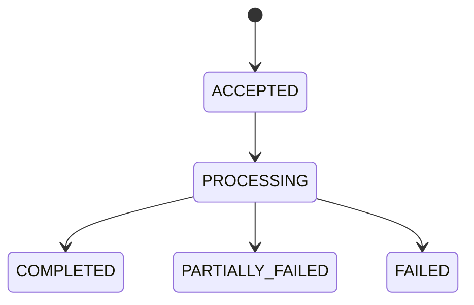
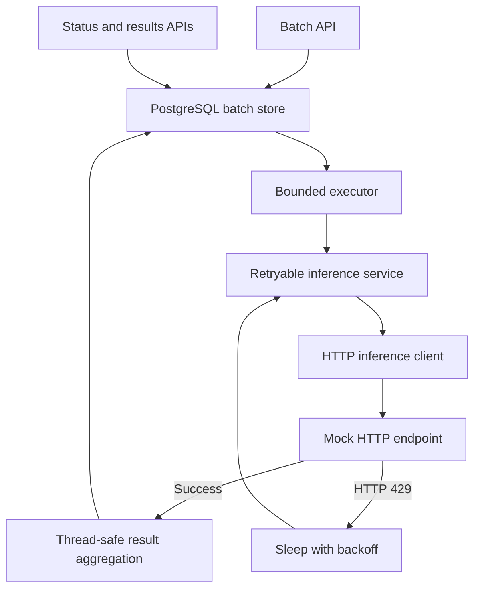

# Batch Inference Engine REST API Service

## 1. Project Objective

Build a backend service that reads a batch of AI prompts, processes them concurrently against a mock rate-limited inference endpoint, and aggregates the results.

The service must acknowledge ingestion immediately while processing continues in the background. It must use a bounded worker pool and safely retry periodic HTTP 429 responses without dropping prompts.

## 2. Confirmed Requirements

### Functional

- Accept either a raw JSON prompt array or a multipart UTF-8 `.txt` file containing one prompt per non-blank line, up to 1,000 prompts by default.
- Return an acknowledgement immediately.
- Process prompts in the background.
- Distribute work across a bounded pool of concurrent workers.
- Call a mock external inference API.
- Retry HTTP 429 responses using sleep-based backoff.
- Do not drop prompts because of rate limiting.
- Aggregate successful inference results into final JSON or save them locally when the batch completes.

### Engineering

- Provide an architecture flow diagram showing the worker pool, retry loop, and aggregation logic.
- Limit worker-pool size so the application does not exhaust memory or spawn unbounded threads.
- Add unit tests proving that 429 backoff triggers without failing the batch when a retry succeeds.
- Add a basic GitHub Actions pipeline.
- Add a README with setup instructions and an explanation of the concurrency model.

### Extension

- Add an endpoint that reports real-time batch progress, such as `400/1000 completed`.

## 3. Rehearsal Assumptions

These decisions fill gaps in the supplied prompt and should be confirmed if possible:

- Support both raw JSON-array ingestion and multipart UTF-8 `.txt` upload with one prompt per line.
- Each prompt is a non-blank string.
- Maximum batch size is configurable and defaults to 1,000.
- The mock is a real HTTP endpoint in the same application, called through an injectable HTTP `InferenceClient`.
- Retry only HTTP 429/rate-limit failures.
- Use three total attempts by default.
- Use exponential backoff beginning at 100 milliseconds.
- After retry exhaustion, mark that prompt failed and allow the batch to complete as `PARTIALLY_FAILED`.
- Preserve the original input order in final output.
- Persist batches, input prompts, prompt states, attempts, outputs, and errors in PostgreSQL.
- Use Flyway migrations and Spring JDBC; use H2 in PostgreSQL mode for local development and tests.
- Keep in-memory batch contexts only for active-process coordination.
- Expose a final-result endpoint so the acknowledged batch can be retrieved later.
- Duplicate prompts are independent work items; idempotency is not required.

## 4. Non-Functional Requirements

- **Bounded concurrency:** Fixed worker count and bounded task queue.
- **Responsiveness:** Batch ingestion returns `202 Accepted` after registration and scheduling, without waiting for inference completion.
- **Correctness:** Every accepted prompt reaches a terminal state and appears in the final persisted batch outcome.
- **Thread safety:** Concurrent workers update batch progress and results safely.
- **Configurability:** Worker count, executor queue capacity, batch size, attempts, and backoff are externalized.
- **Testability:** Retry sleeping and inference calls are injectable.
- **Observability:** Log batch identifiers, prompt indexes, attempts, rate-limit events, terminal outcomes, and elapsed time without logging sensitive prompts by default.
- **Deployability:** The application builds through Maven, runs in Docker, exposes health, and is verified by GitHub Actions.

## 5. API Contract

### 5.1 Submit a Batch

JSON-array form:

```http
POST /api/v1/batches
Content-Type: application/json
```

```json
["Explain bounded concurrency", "Summarize the retry strategy"]
```

Multipart-file form:

```http
POST /api/v1/batches
Content-Type: multipart/form-data
```

```text
file=@prompts.txt

# prompts.txt
Explain bounded concurrency
Summarize the retry strategy
```

Successful response:

```http
202 Accepted
```

```json
{
  "batchId": "7db6f624-57d2-4f39-8e08-8c26e1223f13",
  "status": "ACCEPTED",
  "total": 2
}
```

Validation:

- `file` must be present, non-empty, UTF-8 text, and use a `.txt` filename.
- JSON input must be a non-empty array of strings.
- Every uploaded line or JSON array item must contain a non-blank prompt.
- Batch size must not exceed `inference.max-batch-size`.
- Malformed input returns `400 Bad Request`.

### 5.2 Retrieve Batch Progress — Extension

```http
GET /api/v1/batches/{batchId}
```

```json
{
  "batchId": "7db6f624-57d2-4f39-8e08-8c26e1223f13",
  "status": "PROCESSING",
  "total": 1000,
  "completed": 400,
  "failed": 2,
  "finished": 402
}
```

- Return `200 OK` when found.
- Return `404 Not Found` when absent.

### 5.3 Retrieve Aggregated Results

```http
GET /api/v1/batches/{batchId}/results
```

If processing is incomplete:

```http
202 Accepted
```

```json
{
  "batchId": "7db6f624-57d2-4f39-8e08-8c26e1223f13",
  "status": "PROCESSING",
  "completed": 400,
  "failed": 2,
  "total": 1000
}
```

When processing is complete:

```http
200 OK
```

```json
{
  "batchId": "7db6f624-57d2-4f39-8e08-8c26e1223f13",
  "status": "COMPLETED",
  "total": 2,
  "completed": 2,
  "failed": 0,
  "results": [
    {
      "index": 0,
      "status": "COMPLETED",
      "output": "Mock inference output",
      "attempts": 2,
      "error": null
    },
    {
      "index": 1,
      "status": "COMPLETED",
      "output": "Another output",
      "attempts": 1,
      "error": null
    }
  ]
}
```

## 6. State Model



Batch terminal-state rules:

- `COMPLETED`: all prompts completed successfully.
- `PARTIALLY_FAILED`: at least one prompt succeeded and at least one failed.
- `FAILED`: every prompt failed.

Each prompt moves from `PENDING` to `PROCESSING`, then to either `COMPLETED` or `FAILED`.

## 7. Components



### Responsibilities

- `BatchController`: HTTP validation and response mapping.
- `BatchService`: Register batch, schedule prompts, retrieve state/results.
- `BatchProcessor`: Execute one prompt and publish its terminal outcome.
- `RetryableInferenceService`: Apply retry policy around the client.
- `InferenceClient`: Abstraction for inference calls.
- `MockInferenceClient`: Loopback HTTP adapter implementing `InferenceClient`.
- `MockInferenceController`: Deterministic endpoint returning real HTTP 200/429 responses.
- `Sleeper`: Abstraction around sleeping for testability.
- `JdbcBatchStore`: Transactional persisted batch and prompt state.
- `InMemoryBatchStore`: Concurrent map used only for active batch contexts.
- `BatchContext`: Atomic progress counters and indexed concurrent results.

## 8. End-to-End Flow

### Submission

1. Controller validates and parses the uploaded text file.
2. Service generates a UUID `batchId`.
3. Service persists the batch and all indexed input prompts, then registers an active `BatchContext`.
4. Service submits one task per prompt to the bounded executor.
5. Controller returns `202 Accepted` without waiting for those tasks.

### Prompt Processing

1. Worker changes the prompt state to `PROCESSING`.
2. Worker calls `RetryableInferenceService`.
3. On success, transactionally store the output and number of attempts.
4. On HTTP 429 with attempts remaining, sleep and retry.
5. On exhausted 429 or non-retryable failure, store a failed result.
6. Increment exactly one terminal counter.
7. Increment `finishedCount` once.
8. If `finishedCount == total`, compute and persist the final batch state.

### Retrieval

1. Query PostgreSQL by `batchId`.
2. Return progress counters immediately.
3. For final results, sort indexed results by input index.

## 9. Concurrency Design

### Bounded Executor

- `corePoolSize == maxPoolSize == inference.worker-count`.
- Executor queue capacity is configured.
- A semaphore atomically reserves worker-plus-queue capacity for the complete batch before persistence.
- Use an explicit rejection policy.
- The request must not silently lose work when the executor queue is full.

For the expected maximum of 1,000 prompts, configure enough queue capacity to hold an accepted batch or reject the batch before partially scheduling it. A production system would use a durable queue rather than retaining accepted work only in memory.

### Shared State

- Store active contexts in `ConcurrentHashMap<UUID, BatchContext>` and authoritative state in PostgreSQL.
- Use `AtomicInteger` or `LongAdder` for counters.
- Store results by input index using `ConcurrentHashMap<Integer, PromptResult>`.
- Avoid concurrent writes to ordinary `ArrayList`.
- Use one atomic `finishedCount` for the terminal-state check.

### Ordering

Workers may finish in any order. The result endpoint sorts by the original prompt index, preserving deterministic output without serializing execution.

## 10. Retry Design

Default policy:

```text
Attempt 1
  429 → sleep 100 ms
Attempt 2
  429 → sleep 200 ms
Attempt 3
  429 → mark prompt FAILED
```

- Backoff and maximum attempts are configurable.
- Retry only the rate-limit exception/status.
- Restore the thread interrupt flag if sleep is interrupted.
- Sleeping blocks a worker thread, which is acceptable because the exercise explicitly requests sleep-based backoff.
- A production system could use delayed scheduling or a message broker to avoid occupying workers during long delays.

## 11. Error Handling

- Invalid request: `400 Bad Request`.
- Unknown batch: `404 Not Found`.
- Full executor before scheduling: reject cleanly, preferably `503 Service Unavailable`, rather than acknowledge work that will be lost.
- Individual inference failure: record it in the batch; do not fail unrelated prompt tasks.
- Transient completion-persistence failure: retry, then queue for in-process reconciliation.
- Unexpected controller error: consistent `500` response without internal stack traces.

Example error body:

```json
{
  "timestamp": "2026-09-15T07:00:00Z",
  "status": 400,
  "code": "VALIDATION_ERROR",
  "message": "Request validation failed",
  "details": {
    "prompts[1]": "must not be blank"
  }
}
```

## 12. Configuration

```yaml
spring:
  datasource:
    url: ${JDBC_DATABASE_URL}
    username: ${DB_USERNAME}
    password: ${DB_PASSWORD}
  flyway:
    enabled: true

server:
  port: ${PORT:8080}
  address: 0.0.0.0

inference:
  max-batch-size: ${MAX_BATCH_SIZE:1000}
  worker-count: ${WORKER_COUNT:8}
  queue-capacity: ${QUEUE_CAPACITY:2000}
  max-attempts: ${MAX_ATTEMPTS:3}
  initial-backoff-ms: ${INITIAL_BACKOFF_MS:100}
  mock-rate-limit-every: ${MOCK_RATE_LIMIT_EVERY:4}

management:
  endpoints:
    web:
      exposure:
        include: health,info,metrics
```

## 13. Testing Strategy

Highest-priority tests:

1. Valid JSON-array and text-file batches return `202` before processing completes.
2. Empty and oversized batches return `400`.
3. Executor concurrency never exceeds configured worker count.
4. `429 → success` retries and records a successful prompt.
5. `429 → 429 → success` invokes expected backoff delays.
6. Exhausted 429 attempts produce one failed result.
7. Non-429 failure is not retried.
8. Interrupted backoff restores the interrupt flag.
9. Concurrent results preserve all prompts without counter loss.
10. Final output follows input order despite out-of-order completion.
11. Mixed outcomes produce `PARTIALLY_FAILED`.
12. Status/results return `404` for an unknown batch.
13. Persisted terminal results survive context loss.
14. Startup recovery marks unfinished persisted prompts failed.
15. The mock endpoint returns HTTP 429 and the batch-level client recovers.

Tests must mock `Sleeper`; they must not wait for real backoff durations.

## 14. Observability

Log structured fields:

- `batchId`
- prompt index rather than full prompt text
- attempt number
- retry delay
- final status
- duration

Expose `/actuator/health`. Useful metrics include active workers, executor queue depth, completed prompts, failed prompts, 429 count, retries, and inference latency.

## 15. Deployment and CI

- Package as an executable Spring Boot JAR.
- Run Flyway migrations against managed PostgreSQL during startup.
- Provide a multi-stage Dockerfile.
- Bind to `0.0.0.0` and `${PORT:8080}`.
- GitHub Actions runs `./mvnw --batch-mode clean verify` for pushes and pull requests.
- Deploy the Dockerfile to DigitalOcean App Platform if deployment remains part of the surrounding exercise instructions.

## 16. Trade-offs and Production Evolution

PostgreSQL preserves submitted prompts and results across restart. On startup, unfinished prompts are marked failed because the bounded executor itself is not a durable queue. Multiple replicas still require work claiming or a broker. For production:

- Use a durable broker for accepted work.
- Use delayed retries rather than sleeping worker threads.
- Add retention and cleanup policies.
- Add per-customer quotas and rate limiting.
- Protect external side effects with idempotency.

Kafka and Flink are not required merely because a batch contains 1,000 prompts. Flink is justified only for stateful stream transformations, joins, windowing, or event-time processing—not this bounded task executor.

## 17. Definition of Done

- A valid batch returns `202` immediately.
- Prompts run concurrently through a bounded executor.
- The mock inference client periodically rate-limits requests.
- Rate-limited prompts sleep and retry safely.
- Successful outputs are aggregated without loss and in input order.
- Exhausted prompts are represented as failures.
- Required retry tests pass.
- Architecture diagram, README, Dockerfile, and GitHub Actions exist.
- The complete Maven test suite passes.
