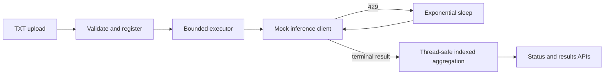

# Batch Inference Engine

Java 17/Spring Boot service that accepts a text file of prompts, acknowledges it
with `202 Accepted`, and processes every line asynchronously through a bounded
mock inference worker pool. HTTP 429-like failures use three total attempts with
testable exponential backoff.

## Run locally

Prerequisites: Java 17+.

```bash
./mvnw --batch-mode clean verify
./mvnw spring-boot:run
```

Create an input file:

```text
Explain bounded concurrency
Summarize exponential backoff
Give one benefit of immutable snapshots
Trigger the deterministic fourth-item retry
```

Submit and query it:

```bash
curl -i -F 'file=@prompts.txt;type=text/plain' \
  http://localhost:8080/api/v1/batches

curl http://localhost:8080/api/v1/batches/{batchId}
curl -i http://localhost:8080/api/v1/batches/{batchId}/results
curl http://localhost:8080/actuator/health
```

The results endpoint returns `202` while work is running and `200` with ordered
terminal results when complete. Unknown IDs return `404`; invalid uploads return
`400`; a batch that cannot fit in the bounded executor returns `503`.

## Input contract

- `multipart/form-data` part named `file`
- UTF-8 filename ending in `.txt`
- One non-blank prompt per line
- At most `MAX_BATCH_SIZE` lines (1,000 by default)
- A normal final newline is accepted; internal blank lines are rejected

## Concurrency and retry



The executor has a fixed worker count and bounded queue. Admission is serialized
and checks that the entire batch fits before scheduling, preventing a partially
accepted batch under normal operation. Each prompt has an atomic state transition;
the synchronized terminal update publishes its indexed result and counters before
publishing the final batch state. Results are sorted by input index.

Only rate-limit failures are retried. Defaults are attempt 1, 100 ms backoff,
attempt 2, 200 ms backoff, then attempt 3. Tests inject `Sleeper`, so retry unit
tests perform no real waiting. Interrupted sleep restores the interrupt flag and
records that prompt as failed.

## Configuration

| Environment variable | Default |
| --- | ---: |
| `PORT` | `8080` |
| `MAX_BATCH_SIZE` | `1000` |
| `WORKER_COUNT` | `8` |
| `QUEUE_CAPACITY` | `2000` |
| `MAX_ATTEMPTS` | `3` |
| `INITIAL_BACKOFF_MS` | `100` |
| `MOCK_RATE_LIMIT_EVERY` | `4` |

The deterministic mock rate-limits the first attempt of every Nth prompt; set
`MOCK_RATE_LIMIT_EVERY=0` to disable it.

## Docker and DigitalOcean

```bash
docker build -t batch-inference-engine .
docker run --rm -p 8080:8080 batch-inference-engine
```

`.do/app.yaml` deploys the Dockerfile to DigitalOcean App Platform:

```bash
doctl apps create --spec .do/app.yaml
```

## Scope and limitations

State is intentionally in memory: application restart loses batches, and multiple
replicas do not share state. A production version should persist metadata/results
and place accepted work on a durable queue. Delayed retries should replace sleeping
workers when backoffs become long. Database persistence is deliberately deferred
to keep this exercise complete, testable, and deployable within its time limit.
